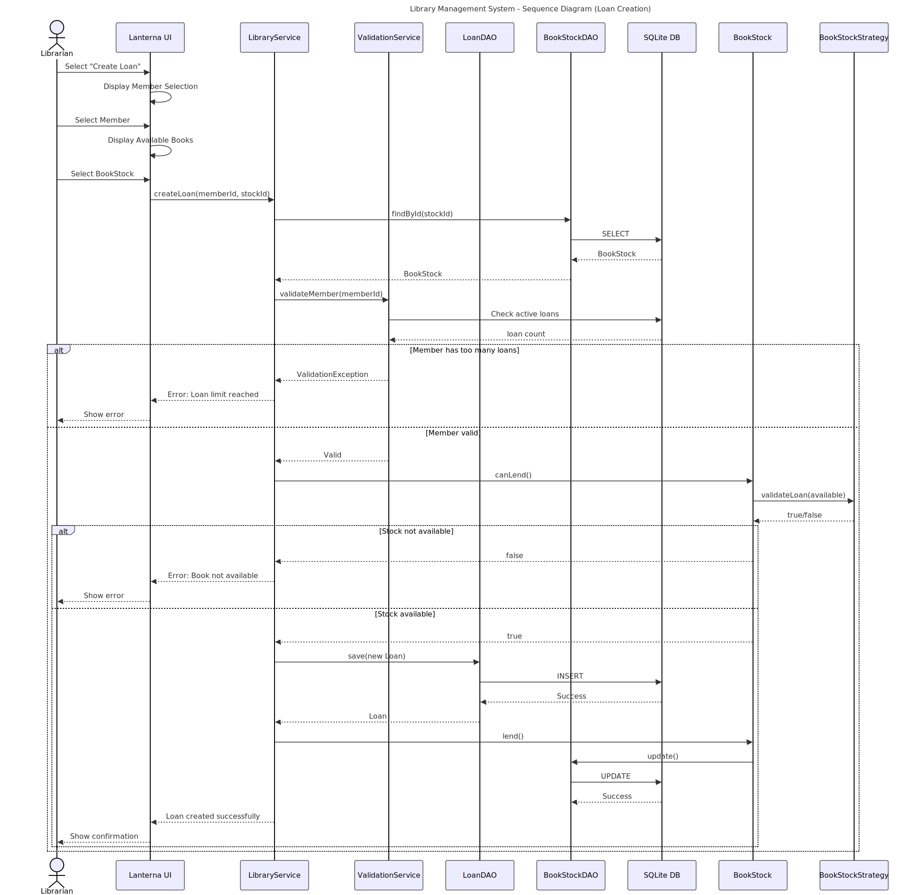

# Library Management System (TUI)

A standalone Terminal User Interface (TUI) application designed for librarians to manage book inventory, member records, and lending workflows. Built with Java 21, this system leverages Hibernate for persistent storage and the Strategy design pattern for specialized inventory management.

## Table of Contents

- [Library Management System (TUI)](#library-management-system-tui)
  - [Table of Contents](#table-of-contents)
  - [Overview](#overview)
  - [Key Features](#key-features)
  - [Architecture](#architecture)
  - [Technology Stack](#technology-stack)
  - [Diagrams](#diagrams)
    - [Use Case Diagram](#use-case-diagram)
    - [Class Diagram](#class-diagram)
    - [Sequence Diagram: Loan Creation](#sequence-diagram-loan-creation)
  - [Project Structure](#project-structure)
  - [Prerequisites](#prerequisites)
  - [Installation](#installation)
  - [Usage](#usage)
    - [Navigation](#navigation)
    - [Management Hierarchy](#management-hierarchy)
  - [Data \& Reporting](#data--reporting)

## Overview

This system provides a localized, high-performance environment for small-scale libraries (up to 100 books and 10 users). It prioritizes data integrity through transactional operations and offers a sophisticated stock management system that adapts behavior based on book genres.

## Key Features

- **Comprehensive CRUD**: Complete management of Books, Members, and Loans.
- **Advanced Stock Management**: Implements a Strategy Pattern to handle availability and loan policies differently for genres like Fiction, Sci-Fi, and Mystery.
- **Robust Lending Workflow**: Tracks loan dates, due dates, return statuses, and automatically calculates overdue fees.
- **Hybrid TUI**: A sophisticated user interface built with Lanterna featuring menu-driven navigation, forms for data entry, and scrollable lists.
- **Data Integrity**: Enforces dependency rules (e.g., preventing the deletion of a member with active loans).
- **Automated Reporting**: Generates CSV reports for inventory and lending history.

## Architecture

The project follows a **Service-DAO (Data Access Object)** architecture to ensure a clean separation between the user interface, business logic, and the persistence layer.

- **Model Layer**: JPA/Hibernate entities representing the core domain.
- **Strategy Pattern**: Encapsulates genre-specific stock rules into interchangeable strategy classes.
- **Service Layer**: Handles business validation and orchestrates transactions.
- **DAO Layer**: Abstracts SQLite interactions using Hibernate's Session API.
- **UI Layer**: Managed via Lanterna, utilizing a hierarchical screen-based navigation system.

## Technology Stack

- **Language**: Java 21 (LTS)
- **UI Framework**: Lanterna 3.1.1 (Terminal Graphics)
- **Persistence**: Hibernate 6.x ORM
- **Database**: SQLite 3.x
- **Build Tool**: Apache Maven 3.9+

## Diagrams

The system's design is documented using the following diagrams (located in `docs/diagrams/`):

### Use Case Diagram



### Class Diagram



### Sequence Diagram: Loan Creation



## Project Structure

```text
library-management-system/
├── pom.xml
├── README.md
├── docs/
│   └── diagrams/                 # SVG Diagrams
└── src/
    ├── main/
    │   ├── java/
    │   │   └── com/library/
    │   │       ├── App.java      # Entry Point
    │   │       ├── config/       # Hibernate & DB Setup
    │   │       ├── dao/          # Data Access Objects
    │   │       ├── model/        # JPA Entities & Strategies
    │   │       ├── service/      # Business Logic
    │   │       ├── ui/           # Lanterna TUI Screens
    │   │       └── util/         # Export & Date Utilities
    │   └── resources/
    │       ├── hibernate.cfg.xml # Persistence Config
    │       └── import.sql        # Initial Seed Data
    └── test/                     # Testing Suite
```

## Prerequisites

- **Java Development Kit (JDK) 21** or higher.
- **Maven 3.9+** for dependency management.
- A terminal emulator with Unicode support (for optimal Lanterna rendering).

## Installation

1. **Clone the repository**:

   ```bash
   git clone https://github.com/your-username/library-management-system.git
   cd library-management-system
   ```

2. **Build the project**

   ```bash
   mvn clean install
   ```

3. **Run the application**:

   ```bash
   mvn exec:java -Dexec.mainClass="com.library.Main"
   ```

## Usage

Upon launching, the Librarian is greeted with the **Main Menu**.

### Navigation

- **Arrow Keys**: Navigate between menu options.
- **Enter**: Confirm selection or enter a sub-menu.
- **Esc/Back**: Return to the previous screen.

### Management Hierarchy

```text
Main Menu
├── 📚 Books Management
│   ├── View Inventory
│   ├── Register New Book
│   └── Edit/Delete Metadata
├── 👥 Member Directory
│   ├── Register Member
│   └── View Lending History
├── 📋 Loan Operations
│   ├── Issue New Loan
│   ├── Process Return
│   └── View Overdue Items
└── 📊 System Reports
    └── Export Inventory/Loans to CSV
```

## Data & Reporting

The system uses a local SQLite file (`library.db`).

- **Auto-Initialization**: The database schema is generated automatically on the first run.
- **Report Export**: Reports are generated in `.csv` format and saved to the root directory for use in external spreadsheet software.
